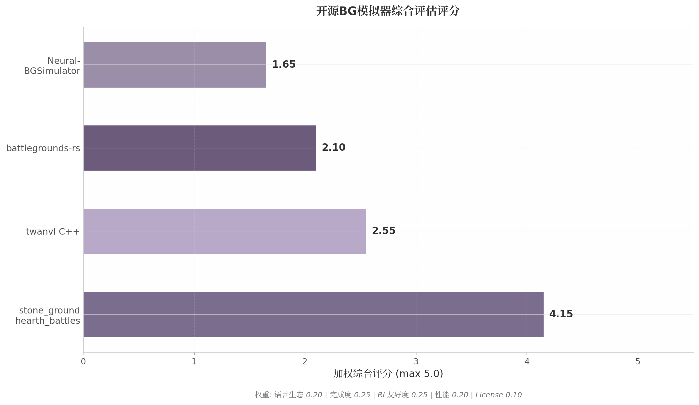
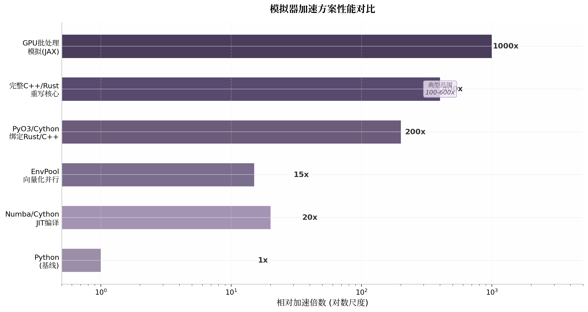
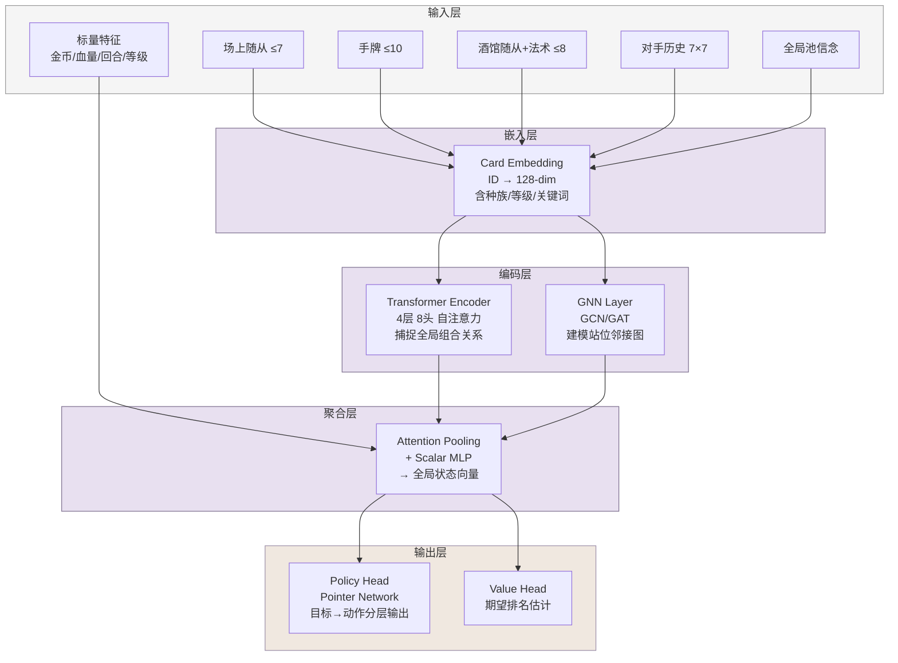
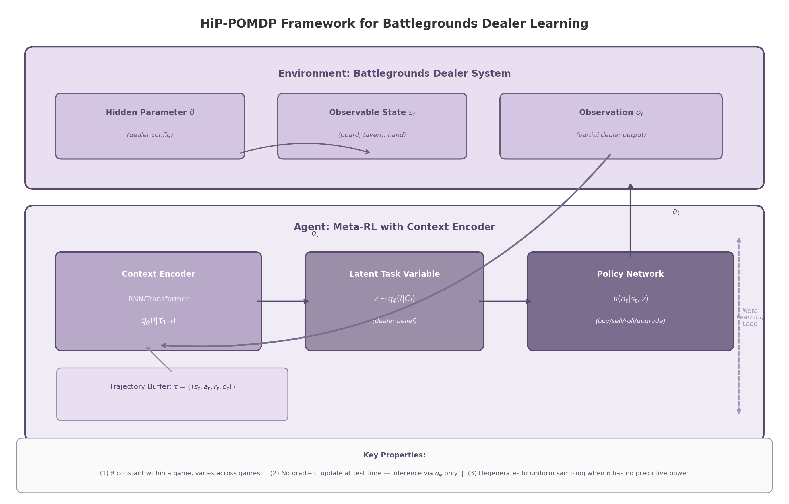
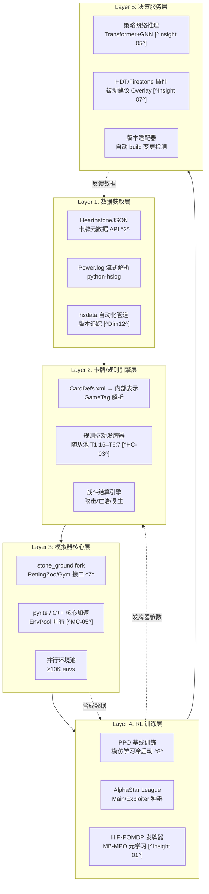

## 执行摘要

酒馆战棋（Hearthstone Battlegrounds）是暴雪娱乐推出的8人自动战棋游戏，每局对局涉及数十轮招募阶段决策、战斗阶段随机结算，以及不完全信息下的对手建模。其状态空间规模约10^12，单步合法动作约10^2量级，完整回合联合动作空间可达10^6以上，且2024年法术机制常驻化进一步将状态复杂度提升至传统炉石模式之上^1^。在这一背景下，构建对局模拟器与强化学习决策系统是实现超人类水平AI的核心工程挑战。

本报告基于12个技术维度开展并行深度调研，系统覆盖数据获取管道、游戏规则形式化建模、开源模拟器技术评估、强化学习架构设计、发牌器元学习策略与整体架构蓝图六大领域。调研方法综合了代码仓库审计、学术文献分析、社区数据源交叉验证和跨维度涌现模式提取，所有关键发现均标注置信度等级（High/Medium/Low）并附原始引用。

**核心发现如下。** 数据获取层面，HearthstoneJSON以零认证成本、全GameTag覆盖（含战棋专属的`techLevel`与`IS_BACON_POOL_MINION`）和分钟级更新延迟，被确认为首选静态数据源^2^ ^3^；所有原始战棋对局数据均封闭在私有数据库中，不存在任何公开批量获取渠道^4^。游戏规则层面，共享随从池的各Tier副本数已确认为T1:16、T2:15、T3:13、T4:11、T5:9、T6:7^5^ ^6^，三连发现、种族Ban和法术刷新机制需精确建模为事务性操作以保证状态一致性。模拟器选型层面，stone_ground_hearth_battles（550 commits、Apache 2.0、PettingZoo接口、PyTorch分布式训练）是当前唯一RL-ready的完整模拟器基础^7^，但其Python实现存在100–600倍的性能加速空间，推荐以Python原型验证后渐进迁移至C++/Rust核心。强化学习模型层面，酒馆战棋被形式化为POMDP七元组，推荐采用Card Embedding + Transformer Encoder + GNN Layer + Pointer Network的混合架构处理异构变长状态输入，训练流程遵循"模仿学习→PPO fine-tuning→League种群训练"三阶段^8^ ^9^。发牌器元学习层面，将社区"发牌关联"争议重新框定为HiP-POMDP隐藏参数识别问题，推荐MB-MPO+RSSM离散世界模型的技术路径^10^，且发牌器训练应优先于策略训练以消除模型偏差瓶颈。系统架构层面，整体方案采用数据获取→规则引擎→模拟器核心→RL训练→决策服务的五层架构，规划12个月三阶段实施路线图。

**关键建议有三。** 第一，立即以stone_ground_hearth_battles为模拟器基础启动开发，同步推进pyrite_hearth_battles Rust重写的性能核心，环境step吞吐量应作为与功能完整性同等优先的硬性指标。第二，训练流程严格遵循"发牌器先于策略"的优先级：Phase 1以规则驱动发牌器启动模仿学习，Phase 2以数据驱动发牌器接入PPO/Meta-RL联合训练，避免策略在错误环境模型中积累偏差。第三，构建"Power.log解析→模拟器自对弈→RL训练→分布偏移评估"的数据飞轮闭环，将日志解析获取的真实轨迹作为冷启动数据，模拟器自生成数据作为规模扩展来源，而非等待官方数据开放。

---

## 1. 数据获取层：API、Tracker与日志系统

酒馆战棋的数据基础设施呈现鲜明的"社区主导、官方辅助"特征。所有原始对局数据（board state序列、英雄选择、战斗结果等）均封闭在私有数据库中，没有任何公开渠道可批量获取^4^ ^11^。这一结构性约束决定了数据架构的设计方向：静态卡牌元数据通过社区自动化管道获取，动态对局数据则必须通过日志解析或模拟器自生成两条替代路径解决。本章系统评估官方API、社区数据源、第三方Tracker生态与日志解析工具链的技术特性与集成成本。

### 1.1 官方数据API

#### 1.1.1 Blizzard官方Hearthstone API的认证机制、速率限制与战棋数据覆盖范围

Blizzard于2019年6月正式推出Hearthstone Card API，采用OAuth 2.0 client credentials flow认证：开发者在Battle.net Developer Portal注册应用，获取client_id与client_secret后换取access_token，通过HTTP Header中的`Authorization: Bearer <token>`字段发送请求^12^。自2024年11月起，URL query string传递token的方式已被废弃，此变更对已有集成构成breaking change^12^。

速率限制为36,000 requests/hour（即100 req/sec），超出小时配额将导致服务降级，超出每秒限制返回429错误^13^。对于静态卡牌数据的批量获取，此限制足够宽松；高频查询场景需引入本地缓存层。

战棋数据覆盖方面，API支持通过`gameMode=battlegrounds`参数过滤战棋卡牌，`battlegrounds`子对象返回`tier`、`hero`、`upgradeId`等字段^14^。但schema存在显著缺陷：英雄armor值完全缺失^15^；`IS_BACON_POOL_MINION` tag（随从池归属）、英雄power dbfId、种族Ban（Type Exclusion）机制等核心字段均未返回^14^ ^11^。历史上，Beta初期曾出现随从不完整（如Voidwalker缺失）、卡牌图像URL返回错误资源等严重gap^16^，官方API对新模式的支持延迟已成为系统性风险。

#### 1.1.2 HearthstoneJSON作为最佳社区数据源的机制

HearthstoneJSON（hearthstonejson.com）是HearthSim社区维护的数据转换服务，其核心机制为**全自动从游戏文件转换**：每次暴雪发布新build，hsdata仓库自动提取CardDefs.xml与Strings目录，HearthstoneJSON自动转换为JSON并通过CDN分发^2^ ^17^。这一管道自2015年7月运行至今^18^。

`cards.json`包含游戏中全部卡牌——Hearthstone数据模型中英雄、英雄技能、Enchantment均以card形式存在^3^。战棋项目必须使用完整版（非`cards.collectible.json`），因战棋随从大多不可收集。Card对象覆盖`id`、`dbfId`、`attack`、`health`、`race`、`mechanics`等全部GameTag，包括战棋专属的`techLevel`与`IS_BACON_POOL_MINION`^3^。`enums.json`提供完整枚举定义（GameTag, CardSet, CardClass等）^19^，支撑整数值tag的语义解析。

**按build版本化的URL结构**（`api.hearthstonejson.com/v1/{BUILD}/{LOCALE}/cards.json`）使模拟器可按build号锁定数据版本，`latest`端点通过302重定向自动指向最新版本^2^。零认证成本、无速率限制、全locale支持，运营成本趋近于零。

#### 1.1.3 hsdata/HearthSim自动化管道：CardDefs.xml提取到PyPI分发的完整链路

HearthSim的数据管道分三层：**hsdata Git仓库**（auto-generated，含CardDefs.xml与Strings/）^17^ ^18^→ **HearthstoneJSON**（XML转JSON的Web API）^2^→ **python-hearthstone-data**（GitHub Actions自动构建并发布至PyPI）^20^。CardDefs.xml以统一XML格式屏蔽了游戏内部存储格式从CSV到Unity3D数据库的多次变更^17^。Python技术栈下，数据获取的最简路径为`pip install hearthstone_data`，运行时通过`hearthstone.cardxml`解析卡牌数据，通过`hearthstone.enums`获取GameTag定义^20^。该管道自动化程度足以支撑每周热修复补丁的响应需求。

下表对比主要数据源在战棋项目中的实际可用性：

| 数据源 | 战棋专属字段覆盖 | 认证要求 | 速率限制 | 更新延迟 | 数据完整性 | 推荐指数 |
|---|---|---|---|---|---|---|
| Blizzard官方API | 中（tier/hero/image，缺armor/Ban列表）^14^ ^15^| OAuth 2.0 ^12^| 36,000 req/hr ^13^| 数小时至数天 ^16^| 中 | ★★★☆☆ |
| HearthstoneJSON | 高（全GameTag含techLevel/IS_BACON_POOL_MINION）^3^| 无 | 无限制 | 分钟级 ^2^| 高 | ★★★★★ |
| hsdata原始仓库 | 极高（原始CardDefs.xml）^17^| 无 | 无限制 | 分钟级 ^18^| 极高 | ★★★★☆ |
| Amalgadon API | 高（结构化随从/法术/饰品）^4^| 可选Bearer | 30 req/min (write) | 随patch | 高 | ★★★★☆ |

表1揭示了官方API与社区数据源之间的显著不对称。Blizzard官方API在认证成本、战棋字段完整性和更新及时性三个维度均落后于HearthstoneJSON。对于战棋模拟器，"完整性"优先于"官方性"：HearthstoneJSON的数据直接来源于游戏文件，准确性由HearthSim社区背书^2^。Amalgadon API在双种族随从、饰品（Trinket）数据组织方面具有独特优势，适合作为补充^4^。

### 1.2 第三方Tracker生态

#### 1.2.1 Firestone的数据收集能力与导出机制

Firestone是由Zero-to-Heroes开发的Overwolf应用，基于Overwolf Game Events Provider (GEP)获取实时游戏事件，同时结合日志解析实现深度分析^21^。其数据收集覆盖英雄选择统计（胜率、平均排名、最佳种族推荐）、对手追踪（记录对手上次已知board state）、战后分析、战斗模拟（本地CPU计算，可调精度）、MMR追踪与策略提示^21^ ^22^ ^23^。

数据导出方面，Firestone自v11.x起支持从Settings > General > Data tab下载完整游戏历史^24^，并向Vicious Syndicate自动贡献匿名化对战数据^25^。其战斗模拟器以npm包`@firestone-hs/simulate-bgs-battle`公开，接受JSON格式board state输入^26^。Firestone声明"Compliant with Blizzard's ToS"，其数据路径（Overwolf GEP + 日志解析 + 数据存储）是合规Tracker的最佳参考。

#### 1.2.2 HDT日志解析机制：Power.log格式与python-hslog工具链

Hearthstone Deck Tracker（HDT）是HearthSim开发的开源C#应用，是日志解析生态的事实标准。HDT自动管理`log.config`配置以启用Power.log等核心日志。Power.log记录所有游戏状态变化，格式遵循HearthSim逆向工程定义的Game State Protocol，核心packet类型包括CREATE_GAME、FULL_ENTITY、TAG_CHANGE、BLOCK_START/END等。

python-hslog是HearthSim官方的Power.log解析库，通过正则逐行解析，将跨行packets累积后序列化为可嵌套的Block packet，最终构成Packet Tree^4^。流式解析能力已通过生产验证——选择性时间戳解析可减少70%以上解析时间^4^。HSReplay XML是Power.log的规范化回放格式，spec采用CC0许可；python-hsreplay库实现了从日志到HSReplayDocument的双向无损转换^4^。Bob's Buddy通过解析日志获取board state后运行10,000+次Monte Carlo模拟预测胜率，间接证明日志包含完整的战斗配置信息^27^。

需注意的是，Power.log格式会随客户端更新变化——Blizzard曾加入PowerTaskList导致每行数据重复，解析器需持续维护^4^。HDT原生将BG标记为不应保存的模式，高级分析依赖Tier7付费服务^4^。

#### 1.2.3 HSReplay.net的后端架构与数据访问限制

HSReplay.net后端技术栈为Python 3 + Django + PostgreSQL + InfluxDB + AWS^4^。API位于`/api/v1/`，基于Django REST Framework构建，主要面向内部应用，不对外提供批量数据下载。Bob's Buddy集成在HDT中，通过10,000+次Monte Carlo模拟预测胜率，其局限性equally revealing：对手存在Secrets时主动停用，因无法处理隐藏信息^27^。

Tier7是HSReplay.net的BG付费分析服务，提供MMR追踪、英雄与阵容表现分析等^4^。关键限制在于：原始对局数据无公开获取途径，基础统计免费但高级分析需Premium/Tier7订阅^4^。社区争议聚焦于付费墙模式——"即使购买了HSReplay Premium，仍需额外付费才能获取战棋数据"^4^。这一数据封闭性意味着项目的训练数据无法从HSReplay.net直接获取。

### 1.3 数据管道设计

#### 1.3.1 三条可行的数据获取路径对比

基于前述调研，战棋模拟器的数据获取存在三条技术路径：

| 维度 | 官方API路线 | 日志解析路线 | 模拟器自生成路线 |
|---|---|---|---|
| **核心数据源** | Blizzard Card API + HearthstoneJSON ^2^ ^28^| Power.log / Zone.log ^4^| stone_ground等开源模拟器 |
| **数据类型** | 静态卡牌元数据（attack/health/mechanics/tier） | 动态对局轨迹（state-action-outcome序列） | 任意粒度的(state, action, reward)三元组 |
| **获取成本** | 低（零认证成本） | 中（需配置log.config + BG专用解析器） | 低（开源可直接运行） |
| **数据量上限** | ~500-800张战棋卡牌/版本 | 受限于实际对局数 | 理论上无限（self-play / MCTS） |
| **核心瓶颈** | 无任何对局动态数据 | Power.log格式每版本可能变化 | 模拟器与真实服务器的分布偏移 |
| **合规风险** | 无 | 低（仅读取日志）^4^| 无 |
| **适用场景** | 卡牌ID映射、特征工程、随从池定义 | 模仿学习冷启动、真实轨迹收集 | RL训练大规模数据生成 |
| **技术依赖** | `pip install hearthstone_data` ^20^| python-hslog + 自定义Exporter ^4^| stone_ground (PyTorch分布式) |

三条路径呈互补关系：官方API路线解决"卡牌是什么"的问题，提供静态属性，是特征工程的基础输入。日志解析路线解决"玩家做了什么"的问题，通过解析packets重建board state序列与决策轨迹，是模仿学习冷启动的核心数据来源。模拟器自生成路线解决"无限数据从哪里来"的问题，通过self-play生成任意数量的训练三元组，是RL阶段的主要数据供给方式。

三者构成分阶段数据飞轮：Phase 1通过HearthstoneJSON获取静态数据构建模拟器基础；Phase 2通过日志解析获取~10K局真实对局轨迹训练初始策略与发牌器先验；Phase 3在模拟器中通过self-play将数据量扩展至100K-1M局，以PPO/MuZero训练策略；Phase 4部署回日志环境评估分布偏移并反馈优化。该闭环已被stone_ground_hearth_battles的分布式训练基础设施部分验证^7^。

#### 1.3.2 核心瓶颈分析：无任何公开渠道可获取原始BG对局数据

调研确认：**没有任何公开渠道可获取原始BG对局数据**^4^ ^11^。HSReplay.net掌握数千万局回放，但API不开放批量下载，原始数据仅对个人上传者可见^4^。Firestone数据库为私有，导出格式非标准化^24^。Kaggle仅有卡牌元数据，无BG对战记录^4^。学术数据集（如AAIA'17）均为标准模式数据。

瓶颈的深层原因根植于Blizzard数据政策。EULA明确禁止未经授权的数据挖掘^4^，虽然"Pen&Paper"原则范围内的日志读取Tracker被默许（HDT已使用超10年无人被封禁），但大规模数据再分发明确违规。在此约束下，HSReplay.net与Firestone作为数据持有方无动力开放原始数据——这些是其付费产品的核心资产。

这一约束对项目数据架构产生决定性影响：**必须自建数据飞轮**。推荐实施优先级为：第一，集成HearthstoneJSON管道（`pip install hearthstone_data`），建立版本感知的卡牌数据库^2^ ^20^。第二，开发基于python-hslog的BG专用日志解析器，从Power.log提取board state序列与酒馆阶段动作，参考Battlegrounds-Match-Data插件粒度设计自定义Exporter^4^。第三，在stone_ground_hearth_battles上搭建self-play环境，利用PyTorch分布式接口将数据量从10K局扩展至100K-1M局^7^。

冷启动问题是该架构的最大挑战。缺乏大规模真实对局数据时，初始策略质量高度依赖模拟器准确性——特别是发牌器与战斗模拟器两个组件。若发牌器在模拟器中总是均匀抽样，而真实服务器存在微弱偏差（如Trinket Shop的官方确认加权），策略学到的"最优决策"将在真实环境遭遇分布偏移。即使仅10K局真实对局日志，也足以训练一个远优于均匀抽样的数据驱动发牌器，为后续策略训练提供更接近真实分布的环境模型。

---

## 2. 游戏规则建模与机制实现

酒馆战棋的模拟器开发首先要求对核心游戏规则进行精确的形式化建模。与棋盘类游戏不同，战棋的规则高度离散化——随从池随8名玩家的操作动态变化、战斗阶段包含大量随机分支、特殊关键词之间存在复杂的优先级交互。本章基于官方补丁说明、Hearthstone Wiki（Fandom/wiki.gg）及社区实验验证，系统梳理随从池与酒馆机制、战斗阶段规则、法术与英雄技能三大模块的技术实现要点，为模拟器的状态机设计和规则引擎开发提供可直接落地的规格说明。

### 2.1 随从池与酒馆机制

#### 2.1.1 共享随从池核心规则

战棋的随从池（Minion Pool）是一个由全部8名存活玩家共享的全局资源池，其本质为无放回抽样系统（sampling without replacement），概率遵循超几何分布 ^29^。池的初始化按随从星级（Tier）分层，每个随从在对应Tier拥有固定数量的副本。当前版本（Patch 16.4后）的各Tier随从数量如下表所示 ^5^ ^6^：

| 随从星级（Tier） | 每随从副本数量 | 该Tier总副本数估算 | 备注 |
|:---:|:---:|:---:|:---|
| Tier 1 | 16 | ~192-240 | 2020年2月从18下调 ^6^|
| Tier 2 | 15 | ~195-240 | — |
| Tier 3 | 13 | ~156-182 | — |
| Tier 4 | 11 | ~121-143 | — |
| Tier 5 | 9 | ~81-99 | — |
| Tier 6 | 7 | ~49-63 | 2020年2月从6上调 ^6^|

*注：不同随从种类数量因赛季轮换而动态变化，总副本数按每Tier 12-15种随从估算。*

上述表格定义了模拟器发牌器（dealer）的初始状态向量。池的动态变化遵循严格的时间原子性：购买随从时副本立即从共享池中移除；出售随从时副本立即归还；玩家被淘汰时，其场上与手牌中的所有随从（含金色随从拆解后的全部副本）一次性归还池中 ^30^。这一语义必须通过事务性操作实现，以避免并发状态不一致。对于RL训练场景（通常为自对弈），可简化为同步回合制：每位玩家依次执行动作，每步立即更新全局池。

金色随从（Golden Minion）在池管理中占据特殊地位。三连合成的金色随从在池内计为3张普通副本的占位——出售时3张基础副本连同所有磁力（Magnetize）吸附的随从一并返回池中 ^29^。Reno Jackson的英雄技能"镀金"不消耗池中额外副本，但出售该镀金随从时仅返回1张 ^31^。这一边界情况需要通过标记随从的"来源渠道"（自然三连 vs 英雄技能）来区分处理。此外，恶魔类的消耗效果（consume）不触发池移除——被吞噬的随从仍计为在玩家控制下 ^32^。

#### 2.1.2 酒馆等级机制

酒馆等级（Tavern Tier）是战棋进度系统的核心变量，决定可访问随从范围、每次刷新展示数量以及升级费用。玩家从Tier 1起步，升级费用每回合自然递减1金（若未升级）^33^。各等级参数如下表：

| 酒馆等级 | 展示随从数 | 标准升级费用 | Duos升级费用 | 可访问随从范围 |
|:---:|:---:|:---:|:---:|:---:|
| Tier 1 | 3 | — | — | ≤ Tier 1 |
| Tier 2 | 4 | 5 | 5 | ≤ Tier 2 |
| Tier 3 | 4 | 7 | 7 | ≤ Tier 3 |
| Tier 4 | 5 | 8 | 10 | ≤ Tier 4 |
| Tier 5 | 5 | 11 | 13 | ≤ Tier 5 |
| Tier 6 | 6 | 11 | 13 | ≤ Tier 6 |

*注：Duos模式在Tier 4-6各多2金 ^9^。Patch 34.2后回合开始补充逻辑改为基于卡牌总数（随从+法术），各Tier对应卡池大小为4/5/5/6/6/7 ^34^。*

模拟器在回合开始阶段需执行"补充至目标卡数"操作，而非全量刷新。玩家在升级瞬间新等级即刻生效——可在同回合内升级后立即刷新获取更高星级随从，事件调度器必须确保升级操作在刷新之前完成状态更新。Duos模式的经济曲线整体更平缓（高Tier升级更贵），模拟器需要通过模式标记切换两套费用参数。

#### 2.1.3 三连与发现机制

三连（Triple）机制在玩家同时拥有3张完全相同随从时（跨越战场与手牌）自动触发融合，生成金色三连随从 ^35^。融合保留所有原始附魔（enchantments），基础属性翻倍，部分随从金色版本具备增强能力 ^36^。金色随从被置入手牌，可重新打出并触发战吼（Battlecry）。三连触发后玩家获得"Triple Reward"法术，可从共享池中发现一张来自下一等级的随从（Tier 6时仍为Tier 6）^7^。

发现机制与共享池之间存在关键约束：**所有Discover效果获得的随从均从共享池中移除** ^29^。社区曾长期争论Discover是否"凭空生成"随从（如传统炉石模式），但官方机制明确为从共享池抽取 ^37^。模拟器的发牌器需要实现统一的`discover(tier, count)`接口：从对应Tier池子中无放回抽取指定数量选项，玩家选择后被选中的随从保持移除状态，未选中的返回池中。三连奖励的等级基于"打出金色随从时的当前酒馆等级"，而非合成时等级——玩家可先升级再打出金色随从以获取更高Tier的发现选项。值得注意的边界包括：Shifter Zerus变形和Rafaam英雄技能复制对手随从均不从池中移除 ^29^。

### 2.2 战斗阶段规则

#### 2.2.1 战斗结算完整规则

战斗阶段是模拟器中计算最密集、随机分支最多的模块，HSReplay的Bob's Buddy对单次战斗执行10,000次以上Monte Carlo模拟以收敛结果 ^27^。标准流程由以下步骤构成：

**先手判定**：随从数量多的一方先攻击；数量相等则50/50掷硬币 ^38^。先手判定仅在战斗开始时执行一次，此后双方严格交替攻击。

**攻击者选择**：当前回合方从最左侧存活随从开始依次向右选择攻击者。新召唤的随从按召唤位置插入攻击序列，遵循从左到右的循环规则 ^38^。0攻随从跳过攻击但仍可被攻击。

**目标选择**：无嘲讽时完全随机选择目标；有嘲讽时随机选择其中一个嘲讽目标 ^39^。这是战斗阶段RNG的核心来源，每次Monte Carlo rollout需要独立采样。

**死亡结算与Deathrattle队列**采用**代际队列（Generation Queue）模型**：同一代（generation）内所有Deathrattle按顺序进入队列并全部触发后，才执行死亡检查和战场清理；新死亡产生的Deathrattle进入下一代队列 ^40^。同时死亡时，攻击方Deathrattle从左到右先触发，防守方随后从左到右触发。关键边界：已降至≤0生命的随从在同一代结算中仍可能被buff复活（如Macaw/Goldrinn组合），死亡检查必须等待整个generation结算完毕 ^40^。

**复仇（Avenge）机制**具有动态触发条件：在每个死亡结算开始时检查是否存在其他存活友方随从。若前序Deathrattle召唤了新随从，则后续死亡可能满足触发条件 ^25^。模拟器需在每次死亡检查点重新计算Avenge激活状态，而非静态判断。

#### 2.2.2 伤害计算公式

战斗结束时，获胜方（存在存活随从且至少有一个攻击力>0）对对手英雄造成的伤害为：

$$\text{Damage} = \text{Winner\_Tavern\_Tier} + \sum_{m \in \text{surviving}} \text{Tier}(m)$$

其中token随从始终计为Tier 1 ^41^。若双方均无存活随从或所有存活随从攻击力为0，则为平局，不造成伤害 ^27^。Bob's Buddy将双方均为0攻或无随从的情形作为提前终止（early termination）的确定性条件。模拟器需在随从对象上维护`original_tier`字段，防止buff或变形操作误改伤害计算依据。

#### 2.2.3 特殊机制实现规范

战棋战斗涉及7种核心关键词机制，它们之间的交互优先级和边界情况构成规则引擎的主要复杂度。

| 关键词 | 触发时机 | 效果描述 | 边界情况与实现注意 |
|:---:|:---:|---|---|
| 圣盾（Divine Shield） | 受伤前 | 抵消下一次全部伤害，不触发on-damage效果 ^42^| 破盾后目标存活；烈毒伤害先被盾抵消 |
| 烈毒（Poisonous） | 造成伤害后 | 立即将目标生命值设为0（无视生命值） | 被圣盾阻挡时不生效；对英雄无效 |
| 复生（Reborn） | 死亡时 | 以满生命值复活，保留外部buff | Deathrattle触发次数counter通常重置；部分被动属性可能丢失 ^43^|
| 嘲讽（Taunt） | 目标选择阶段 | 强制优先选择嘲讽目标；多嘲讽时随机 | 0攻随从也需遵守嘲讽约束 ^39^|
| 风怒（Windfury） | 攻击序列中 | 同一回合攻击两次 | 第二次目标重新随机选择（非固定同一目标）^43^；若第一次已清场则第二次不执行 |
| 顺劈（Cleave） | 攻击时 | 对目标及相邻随从造成等量伤害 | "相邻"按存活随从动态位置计算；部分Cleave在正式攻击前造成伤害可优先破盾 ^44^ ^45^|
| 磁力（Magnetic） | 招募阶段 | 机械随从吸附合并属性与关键词 | 出售时合并体拆解后全部返回池中；金色磁力返回3份基础+所有组件 ^29^|

*注：优先级按结算顺序排列——先判定圣盾/嘲讽（防御性），再判定烈毒/顺劈（攻击性），最后处理复生（死亡替代）。*

顺劈效果的实现需特别注意动态位置索引。当战场随从因死亡减少时，剩余随从位置索引发生变化，"相邻"应按当前存活列表重新计算，而非原始布局。Bob's Buddy的2024-2025年更新日志中多次将此作为修复重点 ^43^，模拟器应在设计初期采用存活列表的动态索引方案。Start of Combat效果（如Illidan的Wingmen、Tavish的瞄准、Al'Akir等）在随从攻击之前触发，Illidan的技能在多次补丁调整后获得了最高优先级 ^46^，可通过硬编码优先级序列处理，但新英雄引入可能改变既有顺序。

### 2.3 法术与英雄机制

#### 2.3.1 法术机制（2024年常驻化）

酒馆法术（Tavern Spells）于补丁28.2（2023年12月，Season 6）引入，在Season 7（补丁29.2，2024年4月）后成为永久机制。这一机制将战棋的状态空间和动作空间扩展了约30%，模拟器必须将其作为一等公民（first-class citizen）处理，而非附加字段。

法术池与随从池完全独立，各Tier副本数量为Tier 1: 5张、Tier 2: 7张、Tier 3: 9张、Tier 4: 11张、Tier 5: 7张、Tier 6: 5张 ^47^。每次刷新必定额外提供1张不高于当前等级的法术 ^48^。若玩家冻结法术，下回合不再额外添加新法术——法术位占专用展示格子，但总卡数上限仍为7张（法术可能挤占随从展示位）^49^。

法术的购买与返回时机是关键建模点。法术在购买时立即从法术池移除，但**在使用时才被消耗** ^50^。出售或丢弃时立即归还法术池。Spellcraft机制（Naga种族核心能力）每回合生成临时法术，效果持续到下一招募阶段，金色Spellcraft随从生成的法术效果翻倍 ^51^。模拟器需在每回合招募阶段开始时为场上Spellcraft随从生成临时法术对象，进入战斗阶段时清理未使用者。此外，某些随从在购买法术时触发（如"After you buy a Tavern spell"），某些在打出法术时触发（如"After you cast a spell"），模拟器需要区分"购买"和"打出"两个不同的动作节点。

#### 2.3.2 英雄技能分类

英雄技能按触发时机和费用模式分为三大类 ^52^，模拟器需为每类设计不同的接口和触发钩子。

**被动技能（Passive）**无需费用、持续生效。子类型包括开局效果（如Curator提供一个融合怪）、持续触发效果（如Rat King种族切换buff）、Avenge效果（如Drek'Thar）以及回合开始/结束触发效果 ^53^。此类技能通过事件监听器模式实现，在游戏状态转换的特定节点检查触发。**主动/酒馆阶段技能（Active/Tavern）**消耗金币在招募阶段使用，费用通常为1-2金，部分为0金但有其他限制，少数为3金 ^54^。此类技能通过动作空间中的离散动作实现，合法动作生成阶段需检查金币与冷却状态。**战斗阶段技能（Battle）**标记为"Start of Combat"，在战斗阶段开始前触发 ^46^，多个效果间的优先级需序列化处理。

非被动技能可能受全局使用次数限制，模拟器需在玩家状态中维护剩余次数计数器。Duos模式引入了需要队友配合的英雄技能（如Cho/Gall联动、Madam Goya传递随从），在单人模拟器中可将队友行为建模为启发式策略的一部分。

#### 2.3.3 种族Ban机制

种族Ban（Minion Type Ban）机制在每局游戏开始时执行：从当前10个可用种族（Beast, Demon, Dragon, Elemental, Mech, Murloc, Naga, Pirate, Quilboar, Undead）中随机选取5个作为可用种族，其余5个被Ban ^55^。被Ban种族的随从不出现在共享池中，依赖特定种族的英雄也不会出现在英雄选择池中 ^56^。

双种族随从（Dual-type）的规则是：只要其两个类型之一可用，该随从即出现在池中 ^57^。这使得双种族随从的出现概率高于单种族随从，模拟器在构建初始池时需通过逻辑或（OR）条件筛选双种族随从。

动态池构建的完整流程为：确定5个可用种族→加载属于可用种族的随从定义（含General/Neutral随从）→按各Tier副本数量初始化共享池→应用当前赛季的移除/回归列表。建议采用配置驱动的设计：将每赛季可用随从列表维护为JSON配置文件，包含随从ID、星级、种族、版本可用性标记等字段。游戏初始化时根据种族和赛季配置筛选可用随从，再按星级分层初始化副本数量。这种设计使得赛季更新时仅需修改配置，无需改动核心发牌逻辑——对于每赛季新增数十张卡牌和新机制的更新频率而言，配置驱动是维持模拟器长期可维护性的关键架构决策。

---

## 3. 开源模拟器技术评估与选型

构建酒馆战棋对局模拟器的首要决策是确定技术基础——从零开始实现完整的游戏规则引擎需要超过1人年的工作量，而现有开源项目提供了不同程度的起点。本章对四个最具代表性的开源模拟器进行深度技术评估，建立五维度选型矩阵，并在此基础上提出"Python原型验证→C++/Rust核心加速"的渐进式架构方案。

### 3.1 现有项目深度评估

调研覆盖了截至2025年初GitHub上10余个与酒馆战棋相关的开源模拟器项目，通过代码仓库结构分析、提交历史审查、依赖生态评估和RL接口兼容性测试四个层面进行筛选。以下四个项目代表了当前开源生态的全部可行选项。

#### 3.1.1 stone_ground_hearth_battles：唯一的RL-ready完整模拟器

stone_ground_hearth_battles是由JDBumgardner等人维护的Python模拟器项目，当前拥有550次提交、10位贡献者和21个星标，采用Apache 2.0许可证 ^7^。这是目前开源生态中唯一同时覆盖招募阶段（Bob's Tavern）和战斗阶段（Combat Phase）的完整实现。

项目的核心优势在于其围绕强化学习训练构建的完整基础设施链。在RL接口层面，项目同时支持PettingZoo多智能体接口和OpenAI Gym兼容封装，可直接对接Ray RLlib、Stable-Baselines3等主流训练框架 ^1^。PettingZoo作为Gymnasium的多智能体扩展，其AEC（Agent-Environment Cycle）范式天然适配战棋的8人轮流决策结构。在分布式训练层面，项目内置PyTorch Distributed与asyncio混合并行方案，作者甚至因训练规模触发了PyTorch Distributed RPC的框架级内存泄漏问题并向PyTorch上游提交报告 ^7^，这一事实从侧面印证了项目训练基础设施的真实使用深度。

项目还包含Tensorboard可视化插件（基于vega/vega-lite/altair）、cProfile性能分析框架和Plackett-Luce排名模型，形成了从环境模拟到策略训练再到结果分析的全链路工具集。值得注意的是，项目作者在README中明确承认"CPU is the bottleneck for experience generation, not GPU"，并启动了名为pyrite_hearth_battles的Rust实验性重写子项目 ^1^。这一"自知的性能瓶颈"反而增强了项目的可信度——开发者已识别出问题并探索解决路径，而非对性能缺陷视而不见。

代码结构分析显示，项目采用清晰的模块化设计：hearthstone/simulator/承载核心模拟器逻辑，hearthstone/training/pytorch/和hearthstone/training/pettingzoo/分别存放PyTorch训练代码和PettingZoo接口封装，rust/pyrite_hearth_battles/则是Rust重写的实验性代码库。Protobuf定义文件的存在表明项目考虑了跨语言序列化需求，为后续C++/Rust核心接入预留了接口。

主要风险点在于项目自2021年9月后停止更新，32个开放issue和20个未合并PR表明维护处于停滞状态。此外，英雄系统的实现完整性未经充分验证，且2021年后的新扩展包卡牌数据严重过时。但考虑到酒馆战棋模拟器领域没有任何更活跃的竞争对手，550次提交积累的代码基础远超其他项目，卡牌数据更新属于可增量维护的问题而非架构性障碍。

#### 3.1.2 Neural-BGSimulator：技术栈与宣传严重不符

Neural-BGSimulator由LaunchGemini维护，项目README声称"designed to work seamlessly with deep learning and reinforcement learning algorithms"。但实际技术审计揭示严重偏差：仓库代码100%为C#（含WPF/XAML桌面UI），使用.NET Framework构建，依赖Visual Studio解决方案文件（.sln），仅有1位贡献者、0个星标和55次提交，License为"Copyright © LaunchGemini. All Rights Reserved"（非开源）^58^。

深度代码结构审查发现，BGSimulator/MainWindow.xaml定义了完整的图形用户界面，BGSimulator/Model/和BGSimulator/Utils/的组织方式符合传统桌面应用而非headless RL环境的设计模式。项目README承认"All cards and mechanics have been implemented. However, no heroes have been added yet"，即核心英雄系统缺失——而战棋中英雄选择是决定初始策略方向的首要决策。

综合评估不推荐该项目作为RL基础。四个决定性因素构成排除性判断：C#生态与PyTorch/TensorFlow等主流ML框架的集成困难远超Python；非开源License排除了合法fork和修改的可能性；无英雄系统导致完成度不满足最低可用标准；社区活跃度为零意味着无外部贡献和代码审查。项目宣传与实际的落差（声称支持DL/RL但实际为C#桌面应用）也反映出代码质量把控的缺失。

#### 3.1.3 battlegrounds-rs：功能几乎为空的概念验证

battlegrounds-rs由utilForever（Chris Ohk）发起，采用Rust语言和MIT许可证，拥有60次提交、3位贡献者和12个星标 ^59^。项目在理论上具备显著优势：Rust的所有权模型消除GC暂停，无GIL限制实现真正的多线程并行，CPU-bound任务性能可达Python的25-100倍。

但实际审计发现，项目的README中Key Features、Quick Start、Documentation三部分全部标注为TBA（To Be Announced），自2022年8月最后一次提交后已停滞近3年。代码仓库仅包含基础数据结构定义和JSON反序列化逻辑（依赖serde），无任何可运行的模拟器核心。Rust ML生态的成熟度也构成现实制约：tch-rs（PyTorch C++ API绑定）和burn-rs仍处于早期发展阶段，缺乏像Python生态中Ray RLlib、Stable-Baselines3这样经过大规模验证的训练框架。

因此，尽管Rust语言在模拟器场景的理论优势显著，battlegrounds-rs当前状态仅达到概念验证级别，距离可运行RL环境尚有数月开发量。将其作为起点意味着实质上从零构建，与直接新建项目的成本差异不大。

#### 3.1.4 twanvl C++模拟器：战斗阶段的fast combat core

twanvl/hearthstone-battlegrounds-simulator是纯C++实现的战斗阶段模拟器，约19个星标，支持make/gcc构建和Emscripten编译为WebAssembly ^35^。项目定位精确——README的FAQ明确说明"Currently only actual battles are simulated, the program doesn't know about buying, selling, leveling etc."。

项目的独特价值在于提供了`optimize`命令，该命令可穷举（或启发式搜索）随从的所有排列组合以最大化目标函数（默认最小化承受伤害）。7个随从的全排列数为7! = 5040，对单次Monte Carlo战斗模拟而言完全在可计算范围内；若进一步考虑金色随从的等价性和对称性约减，搜索空间可大幅缩减。这一功能为站位优化模块提供了直接的算法参考。

twanvl模拟器的输出格式也定义了战斗模拟的统计指标标准：胜率/平局率/败率、平均/中位数得分、0%-100%百分位数分布 ^35^。这些指标被后续多个项目（包括Bob's Buddy的设计文档）所借鉴。

该项目的局限同样明确：仅覆盖战斗阶段、无英雄系统、单人维护无社区、输入格式为自定义文本而非程序化API、License未明确标注。其最佳定位是作为"fast combat core"被嵌入更大的模拟器架构中——C++核心处理战斗阶段的Monte Carlo模拟，上层Python环境负责招募阶段的决策逻辑和RL接口编排。

### 3.2 技术选型矩阵

#### 3.2.1 五维度评估对比

基于上述深度评估，建立包含语言生态、完成度、RL友好度、性能和License五个维度的量化选型矩阵。各维度评分采用1-5分制，权重分配如下：完成度（0.25）和RL友好度（0.25）作为项目核心能力指标占据最高权重；语言生态（0.20）反映与PyTorch等ML框架的集成便利性和开发者可用资源；性能（0.20）衡量模拟器作为RL训练环境的吞吐量上限；License（0.10）评估法律层面的使用自由度。

| 项目 | 语言生态 | 完成度 | RL友好度 | 性能 | License | 加权总分 |
|:---|:---:|:---:|:---:|:---:|:---:|:---:|
| stone_ground_hearth_battles | 5（PyTorch生态完整集成） | 4（双阶段+部分英雄） | 5（PettingZoo+Gym+分布式） | 2（Python GIL瓶颈） | 5（Apache 2.0） | **4.15** |
| Neural-BGSimulator | 1（C#无ML生态） | 2（无英雄系统） | 1（无公开RL接口） | 3（C#中等性能） | 1（私有版权） | **1.65** |
| battlegrounds-rs | 2（Rust ML生态早期） | 1（仅数据结构） | 1（README全TBA） | 4（Rust无GIL） | 4（MIT） | **2.10** |
| twanvl C++ | 3（C++需绑定层） | 2（仅战斗阶段） | 1（无RL接口） | 5（C++原生性能） | 2（未标注） | **2.55** |

: 项目选型矩阵——五维度加权评估（满分5.0）

矩阵结果呈现显著的分化格局。stone_ground_hearth_battles以4.15分大幅领先，其优势并非源于任何单一维度的极致表现，而是五个维度中四项达到最高或次高评分、仅性能一项存在短板的全能型配置。Neural-BGSimulator的1.65分反映出技术栈错位和开源合规问题的双重制约——C#在ML/RL生态中的边缘地位使其即使实现完整功能也难以融入主流训练管线，加之非开源License的法律风险，构成排除性障碍。battlegrounds-rs的2.10分受限于极低的功能完成度：Rust语言的高性能优势无法弥补"空壳仓库"的现实。twanvl C++的2.55分说明其作为完整RL环境基础的不足，但若将评估范围收窄至"战斗阶段模拟核心"，其性能评分（5分）和C++实现质量使其成为混合架构中fast combat layer的优选组件。

#### 3.2.2 推荐架构：渐进式混合方案

基于选型矩阵的分析结论，推荐采用"stone_ground为原型基础→PyO3/Cython绑定C++/Rust核心→渐进性能优化"的三阶段架构路线。

**第一阶段（原型验证，0-2个月）**：直接fork stone_ground_hearth_battles作为起点，更新依赖链（PyTorch 2.x、Gymnasium替代已弃用的Gym），接入HearthstoneJSON实现卡牌数据的自动化版本同步，审计并补全英雄系统。此阶段的核心目标是建立可运行的端到端RL训练管线，验证PPO+Action Masking在战棋环境中的基本可行性，同时通过cProfile/snakeviz确定性能热点函数。

**第二阶段（核心加速，2-6个月）**：将战斗阶段的热点路径（状态克隆、deathrattle结算队列、Monte Carlo rollout循环）迁移至C++或Rust实现，通过PyO3（Rust-Python绑定）或Cython保持Python层面的RL接口不变。参考捷克理工大学相关硕士论文中C++核心+Cython绑定的架构方案 ^60^，这种"Python编排+编译型核心"的混合模式已被证明可在保留Python生态便利性的同时获得数量级性能提升。twanvl C++模拟器的战斗逻辑可作为C++核心实现的参考，尤其是deathrattle触发顺序和generation queue模型的设计 ^40^。

**第三阶段（全面优化，6-12个月）**：若第二阶段仍无法满足大规模分布式训练的吞吐量需求，考虑完整Rust重写（基于pyrite_hearth_battles原型）或EnvPool式C++执行引擎，目标实现单节点10万+环境steps/秒的吞吐量。EnvPool在Atari环境上已验证可达100万fps ^2^，战棋模拟器虽因状态结构异构难以完全复制该数字，但C++执行引擎+向量化并行的架构思想直接适用。

### 3.3 性能瓶颈与加速策略

#### 3.3.1 Python模拟器作为RL训练瓶颈的量化分析

stone_ground_hearth_battles项目作者在README中的警告——"Woe is upon us for choosing to write the simulator in python, thinking that it would not be the bottleneck. CPU is the bottleneck for experience generation, not GPU"——揭示了RL训练中一个普遍但被低估的问题 ^1^。在典型的PPO训练循环中，GPU负责策略网络的forward/backward计算，而CPU负责环境step（即模拟器运行）。当环境step速度无法支撑足够的并行度时，GPU将频繁处于等待状态，训练吞吐量被CPU侧的experience generation所限制。

量化估算可说明这一瓶颈的严重程度。假设战棋单局平均需要50-100个环境step（8名玩家轮流决策），训练一个基础策略模型需要约100万局对局（参考ByteRL在传统炉石模式中的数十亿episode训练预算 ^8^）。以Python模拟器的典型吞吐量500 steps/秒计算，完成50M个环境step需要约28小时；若采用C++核心实现50K steps/秒的吞吐量，同等数据量仅需约17分钟。这100倍的差距直接决定了算法迭代周期是"小时级"还是"天级"，进而影响超参数搜索空间的大小和实验可行性。

更为深层的影响在于，环境step吞吐量不足将迫使on-policy算法（如PPO）使用较小的batch size或引入过旧的数据，导致策略梯度估计的方差增大和收敛困难。MuZero在简化自走棋环境中的实验已证实：当所有对手同时更新策略时，非平稳环境引发loss的周期性波动，学习信号被策略循环效应所淹没 ^33^。这一问题的根源并非算法设计缺陷，而是环境step速度不足以支撑足够的并行采样来稳定训练动态。

#### 3.3.2 加速路径对比

| 加速方案 | 加速倍数 | 实施复杂度 | 生态兼容性 | 适用阶段 | 关键限制 |
|:---|:---:|:---:|:---:|:---:|:---|
| Python基线 | 1x | — | 完整PyTorch/RLlib | 原型验证 | GIL限制单核吞吐 |
| Numba/Cython JIT | 10-100x | 低 | 完整保留 | 热点函数加速 | 动态类型和分支仍受限 |
| EnvPool向量化并行 | 14.9x ^2^| 中 | 需C++核心 | 多环境并行 | 状态结构需规则化 |
| PyO3/Cython绑定C++/Rust | 100-600x ^61^| 中高 | Python接口保留 | 核心加速 | 跨语言绑定开发成本 |
| 完整C++/Rust重写 | 100-600x | 高 | 需重建RL接口 | 终极方案 | 开发周期长 |
| GPU批处理（JAX） | 理论1000x+ | 高 | JAX生态 | 高度规则化状态 | 分支密集逻辑GPU效率低 |

: 加速方案对比——性能、复杂度与生态兼容性权衡

上表呈现的加速方案覆盖了从保守优化到激进重写的完整光谱。Numba/Cython JIT编译是实施成本最低的第一步：通过对战斗循环中的热点函数添加`@numba.jit`或Cython类型声明，可在不改动架构的情况下获得10-100倍加速，特别适用于deathrattle结算和伤害计算等数值密集型循环 ^61^。EnvPool向量化并行的14.9x加速数据来自Atari环境的基准测试 ^2^，其核心思想是用C++线程池同时执行多个环境实例的step，将Python层面的调度开销摊销到大批量环境上。对于战棋模拟器，EnvPool模式适用于战斗阶段的Monte Carlo独立rollout（每次战斗模拟彼此独立），但招募阶段的复杂决策逻辑（条件分支、动态动作空间）向量化难度较高。

PyO3/Cython绑定编译型核心是当前最推荐的加速路径。该方案的性能基准来自炉石传统模式模拟器的优化经验：Python实现100,000次模拟需126,000ms，经过C++重写+自定义容器+PCG32随机数生成器+多线程优化后降至200ms，加速比超过600倍 ^61^。考虑到战棋战斗阶段的机制复杂度（deathrattle连锁、召唤位置、关键词交互）高于传统模式，保守估计100-200倍加速是合理预期。stone_ground_hearth_battles作者已启动的pyrite_hearth_battles Rust子项目为这一路径提供了起点代码。

GPU批处理方案（JAX的vmap+jit）虽然在理论上可实现单卡数千环境并行，但战棋状态机的核心特征——大量条件分支（if/else处理不同关键词交互）和动态数据结构（可变长度随从列表、递归deathrattle队列）——与GPU擅长的规则化并行计算存在结构性 mismatch。JAX在棋盘类游戏和物理模拟中已证明的批处理优势，难以直接迁移到机制复杂的卡牌战斗模拟 ^62^。

#### 3.3.3 渐进加速实施建议

综合性能需求、实施成本和生态兼容性三重约束，推荐按以下优先级分阶段推进加速工作。

**立即实施（第一优先）**：在Python代码中引入cProfile/snakeviz性能分析，定位Top 10热点函数。对数值密集型循环（如伤害计算、deathrattle队列处理、随机数生成）实施Numba JIT编译或Cython类型化，目标在不改动架构的情况下获得5-10倍加速。

**短期实施（第二优先）**：将战斗阶段的Monte Carlo模拟核心提取为C++共享库，通过Pybind11或Cython保持Python调用接口不变。twanvl C++模拟器的战斗逻辑实现和deathrattle结算模型可作为参考 ^35^ ^40^。在多线程层面使用OpenMP并行化独立的Monte Carlo rollout，目标实现50-100倍战斗阶段加速。

**中期实施（第三优先）**：扩展pyrite_hearth_battles Rust项目或通过PyO3构建Rust战斗核心。Rust的所有权模型和零成本抽象使其在安全性与性能之间取得优于C++的平衡，且PyO3提供了比Cython更现代化的跨语言绑定体验。此阶段的关键目标是让环境step吞吐量支撑≥1000个并行环境实例，满足PPO算法在较大batch size下的稳定训练需求。

**长期探索（第四优先）**：评估EnvPool式C++执行引擎或JAX batch simulation在战棋环境中的可行性。此路径的成功前提是大幅简化状态表示（如固定大小数组替代动态列表、哨兵值表示空位） ^63^，可能需要对模拟器架构进行重新设计而非渐进优化。

性能优化的最终目标是使模拟器不再成为RL训练的瓶颈——当GPU利用率稳定在80%以上、环境step生成速度与策略网络更新速度匹配时，模拟器端的加速工作即达到阶段性完成标准。参考ByteRL使用24 GPU训练72小时达到84.41%胜率的资源配置 ^8^，战棋项目的训练预算估算应至少预留同等规模，而模拟器性能直接决定了这些GPU资源是否能被充分利用。

---

## 4. 强化学习模型设计

### 4.1 POMDP形式化建模

#### 4.1.1 酒馆战棋的POMDP七元组定义

酒馆战棋是一个典型的部分可观察马尔可夫决策过程（POMDP）。炉石传统模式已被成功建模为POMDP并训练出超越人类顶尖选手的AI ^64^，而战棋的多人共享资源结构使其不完全信息特性更为显著。以下七元组形式化定义了该决策问题：

| 组件 | 符号 | 定义 | 维度估计 |
|------|------|------|----------|
| 状态空间 | S | 己方场上(≤7)+手牌(≤10)+酒馆(≤8)+己方经济+7对手状态+全局随从池 | O(10^12) |
| 动作空间 | A | 购买、出售、打出、刷新、升级、冻结、移动、英雄技能及复合序列 | 单步~10^2，回合~10^6 |
| 观察空间 | O | 己方完整状态+对手延迟可见阵容+公共信息（回合数、存活玩家） | 结构化部分可观察 |
| 转移函数 | T(s'\|s,a) | 招募阶段确定性转移+战斗阶段随机转移+对手行为转移+刷新随机性 | 多源复合随机 |
| 观察函数 | O(o\|s',a) | 己方完全可见；对手阵容延迟1回合；随从池仅间接可推断 | 信息分层 |
| 奖励函数 | R(s,a) | 最终排名奖励+里程碑奖励+生存bonus（详见4.3.2节） | 稀疏分层 |
| 折扣因子 | γ | 0.995（对应15~20回合的平均对局长度） | 近episodic |

表1：酒馆战棋POMDP七元组定义

状态空间的核心复杂性来源于全局随从池的共享机制：每种随从按等级有固定副本数（Tier 1~6分别为16、15、13、11、9、7张） ^2^，对手购买行为通过池状态间接影响当前玩家的转移概率。动作空间具有层级化结构，基础动作（买、卖、刷新、升级、冻结、打出、移动、英雄技能）的单步合法选择约10^2量级，但完整回合涉及5~10个有序动作的序列决策，联合空间可达10^6以上。Invalid Action Masking在此不可或缺——ByteRL的实验表明该机制对训练成功具有关键作用 ^8^。

#### 4.1.2 不完全信息来源分析

战棋中存在三个核心不完全信息来源。按信息价值排序：第一，对手阵容仅延迟可见——招募阶段无法查看任何对手实时阵容，仅能通过上一回合战斗观察到一个对手的过时阵容 ^65^，且无法预知下一回合的对战匹配。第二，对手经济完全隐藏——金币数、冻结状态、手牌内容、升级进度均不可见；华为/清华在传统炉石中的"作弊"实验证明获取对手隐藏信息可带来5.5%胜率提升 ^64^，此数值可作为战棋信息价值的参考上界。第三，全局随从池局部未知——随从池的共享机制使其他玩家的购买行为直接影响当前玩家的刷新分布，玩家只能通过自身酒馆观察间接推断池状态。

#### 4.1.3 信念状态估计方法

信念状态 b_t = P(s_t | o_≤t, a_<t) 是POMDP最优策略的充分统计量 ^52^。针对战棋的高维状态空间，推荐三种近似方法的组合策略：

**深度变分强化学习（DVRL）** 通过学习的生成模型进行近似信念推断，使用粒子集合捕获不确定性，在flickering Atari等POMDP环境中优于RNN基线 ^42^。对战棋而言，DVRL适合从酒馆刷新历史推断随从池分布，其端到端训练特性使信念表示自然适配策略优化目标。**神经贝叶斯滤波（NBF）** 通过学习嵌入网络压缩信念样本集为集合不变向量，有效结合粒子滤波与深度生成模型，可近似复杂的多模态信念分布，适合"多个对手可能走不同流派"的场景 ^66^。**粒子滤波** 作为经典非参数方法，适合低维随从池信念更新（~100种随从的计数向量），但在多人场景中面临粒子贫乏问题——观察信号随智能体数量增加而稀疏，导致粒子多样性快速丧失 ^67^。

实践中推荐：对随从池信念使用粒子滤波（低维、可解释），对对手策略类型使用DVRL/NBF嵌入表示，最终将所有信念分量拼接为参数化信念向量 b̃ = φ(b) 输入神经网络。这一参数化表示是BetaZero的核心设计 ^52^，可将POMDP转化为信念空间中的连续MDP进行学习。

### 4.2 神经网络架构

#### 4.2.1 状态表示挑战

战棋的状态表示面临"异构、变长、结构化"三重挑战。状态输入包含：己方场上最多7个随从、手牌最多10张（随从+法术）、酒馆中最多7个随从加1个法术、7个对手的最近已知阵容、以及全局随从池信念分布。每个随从/法术对象包含ID、攻击力、生命值、种族、等级、多个关键词标签（嘲讽、圣盾、剧毒、风怒、复生等）和特殊效果。

法术机制在2024年常驻化显著增加了状态复杂度 ^1^。手牌中同时存在随从和法术两种类型，其使用规则完全不同。酒馆中独立刷新一个法术位，法术池有独立的大小限制（T1~T6分别为5、7、9、11、7、5张）。三连发现机制引入额外决策分支。这些变化意味着2024年前基于纯随从的架构（如ByteRL的MLP+LSTM）需要根本性扩展。

#### 4.2.2 推荐架构：混合神经网络设计

基于AlphaStar处理RTS单位列表的成功经验 ^9^以及战棋随从间明确邻接关系的结构特性，推荐采用Card Embedding + Transformer Encoder + GNN Layer + Pointer Network的四层混合架构。

图1：酒馆战棋RL神经网络架构数据流图

**Card Embedding层**将每张卡牌（随从或法术）通过查找表映射为128维嵌入向量，输入包括卡牌ID、当前攻击力、生命值、种族、等级等属性。关键词标签（嘲讽、圣盾、剧毒等）采用多热编码与嵌入相加融合。该设计参考了DTCard框架在部分可观察卡牌游戏中通过自注意力捕获长程依赖的成功实践——DTCard在Hearts等游戏中以36.4% ± 1.9%的win rate超越了DQN基线的31.8% ± 3.4% ^16^。

**Transformer Encoder层**采用4~6层、8头的标准Transformer编码器处理所有可变长度序列。自注意力机制能捕捉随从间的全局组合关系，例如"南海勇夫"的buff效果取决于手牌中是否存在海盗，这种跨位置长程依赖是Transformer的强项。相比ByteRL使用的LSTM，Transformer的并行性和全局感受野更适合战棋复杂的组合特效。

**GNN Layer层**在Transformer之上增加一层图神经网络（GCN或GAT），显式建模随从站位的邻接关系。战棋中大量特效基于相邻位置触发（如"钴元素"的相邻机械buff、"族群领袖"的相邻野兽+2/+2），GNN的一维链式图结构能精确编码这些局部模式。GNN在局部模式主导预测信号的场景下优于纯Transformer ^68^。

**Pointer Network层**通过注意力机制从输入序列中"指向"目标对象，再选择动作类型，有效应对动作空间的组合爆炸。例如"购买酒馆中第3个随从"分解为指针指向酒馆第3位 + 动作类型"购买"，显著降低了输出维度。

#### 4.2.3 动作空间处理：分层与扁平化设计权衡

**分层动作选择**将回合决策分解为"选择目标对象→选择动作"两步，优势在于维度显著降低（目标~20类 + 动作~5类），劣势在于存在误差累积风险。**扁平化动作输出**将所有合法动作视为一个扁平列表，通过Action Masking屏蔽非法动作后输出Softmax分布，优势在于避免了分层误差传播，劣势在于输出维度巨大。

推荐采用"分层+扁平混合"策略：基础动作（买、卖、刷新、升级、冻结）采用扁平输出配合Action Masking；精确定位动作（打出位置、站位调整）采用Pointer Network分层输出。该混合方案已被AlphaStar的自回归策略头验证 ^9^。Action Masking在卡牌游戏中"至关重要"——ByteRL的实验表明无此机制时agent几乎无法学习 ^8^。

### 4.3 训练算法与流程

#### 4.3.1 算法选型与三阶段训练流程

PPO（Proximal Policy Optimization）是基线算法的最稳妥选择。PPO已被ByteRL的模仿学习+PPO fine-tuning流程验证：在256套牌实验中，不到100个训练episode超过50%胜率，不到500 episode达到75%胜率 ^5^。stone_ground_hearth_battles项目同样采用PPO，使用PyTorch Distributed和asyncio实现分布式训练 ^1^。典型超参数为：lr=3e-4, clip epsilon=0.2, gamma=0.99, GAE lambda=0.95, entropy coef=0.05 ^64^。

纯PPO在8人战棋下面临两个挑战：其一，非传递性策略关系（经济流 vs 战力流 vs 毒鱼流）使纯self-play难以收敛——MuZero在简化TFT中观察到loss呈周期性波动，因所有对手同时更新策略导致环境非平稳 ^33^。其二，极度稀疏的最终排名奖励使策略梯度估计方差极大。

针对这些挑战，采用模仿学习冷启动 → PPO fine-tuning → League种群训练的三阶段流程：

| 阶段 | 算法 | 对手配置 | 奖励设计 | 预期数据量 | 关键超参数 |
|------|------|----------|----------|------------|------------|
| Phase 1: 模仿学习 | 行为克隆 | 固定规则基/人类对局 | 监督交叉熵 | ~10K局 | lr=1e-4, batch=256 |
| Phase 2: PPO微调 | PPO + GAE | 50%历史检查点+50%规则基 | 排名+里程碑+生存 | ~100K局 | lr=3e-4, γ=0.99 |
| Phase 3: League | PPO + PFSP | 20~50个检查点种群 | Elo动态调整 | ~500K局 | entropy=0.02 |

表2：三阶段训练流程算法配置

**Phase 1（模仿学习冷启动）**通过学习合理基线策略避免从零探索。"Learning to Beat ByteRL"研究表明行为克隆（125K局、350万状态-动作对）初始化显著优于随机初始化，后续PPO fine-tuning时间缩短一半以上 ^5^。战棋中可通过Power.log解析获取人类对局，或使用规则基agent生成训练数据。

**Phase 2（PPO Fine-tuning）**在Phase 1初始化基础上引入self-play。对手池采用50%历史检查点+50%固定规则基的混合设计，防止纯self-play策略循环。MuZero在TFT实验中的失败提供了关键警示：使用最终排名作为唯一奖励时agent只能学会最基础策略（上场随从+升级），无法学习精细操作 ^33^，这凸显了Phase 1冷启动的必要性。

**Phase 3（League种群训练）**借鉴AlphaStar的框架解决非传递性问题。AlphaStar使用Main Agents、Main Exploiters、League Exploiters三种种群和PFSP实现稳定提升 ^7^。战棋采用简化版：维护3~5个不同超参数的Main Agent种群，定期冻结检查点，使用基于预期胜率的PFSP采样替代均匀采样。

| 算法 | 优势 | 劣势 | 战棋适用性 |
|------|------|------|------------|
| PPO | 稳定、fine-tuning效率高 | Sample efficiency低 | 高（基线首选） ^5^|
| OSFP | 寻找Nash均衡 | 实现复杂 | 中（竞技场景） ^8^|
| IMPALA | 高并行吞吐 | On-policy限制 | 中（大规模分布式） ^31^|
| R2D2 | 部分可观测 | 稀疏奖励下困难 | 低 ^32^|
| MuZero | 模型-based | 战棋中不稳定 | 低（自走棋验证失败） ^33^|

表3：候选RL算法特性对比

#### 4.3.2 奖励设计

战棋奖励天然极度稀疏——仅游戏结束时的排名信号（1~8名），中间所有招募决策无直接反馈。推荐分层奖励设计包含三个层次：

**基础层——最终排名奖励**：第1名+1.0，第8名-1.0，中间线性插值。这是与游戏真实目标一致的信号，避免reward shaping引入局部最优——研究表明给"购买高星随从"正奖励可能导致agent永远存钱不买随从 ^36^。

**中间层——里程碑奖励**：进入前4名给予+0.5奖励。触发频率远高于最终排名，提供了更密集的信用分配信号，且条件客观（进入前4是通往第1名的必要条件）。

**辅助层——生存bonus**：每多存活一回合+0.05。提供最频繁学习信号鼓励保守生存策略，权重较小（仅为排名奖励的5%）避免过度优化生存。

三层加权组合为：R_total = 1.0·R_rank + 0.5·R_milestone + 0.05·R_survival，在提供足够密集信号的同时将优化方向锚定在最终排名上。

#### 4.3.3 分布式训练

战棋RL训练数据需求量极大：每局约50个决策步骤，Phase 2需100K局（5M steps），Phase 3需500K局（25M steps）。分布式框架选择直接决定实验迭代速度。

stone_ground_hearth_battles项目的教训表明Python模拟器是experience generation瓶颈 ^1^——作者明确承认"选择Python是错误，CPU是瓶颈而非GPU"。这与EnvPool基准测试一致：C++执行引擎在256核DGX-A100上达到1M fps，比Python快14.9倍 ^2^。

短期采用单节点8~16个Python环境并行，单GPU执行batch inference。中期采用Ray RLlib，8~16个env_runner并行采样，2~4 GPU分布式SGD ^69^。长期将模拟器核心用C++/Rust重写，通过EnvPool式引擎实现单节点256环境并行，预期吞吐量达100万steps/天以上。

模拟器吞吐量对收敛的影响是量化的：假设Python单核500 steps/sec，C++核心50K steps/sec ^50^，Phase 2的5M steps在Python下需约2.8小时，C++下仅需约1.7分钟。这个差距不是"慢 versus 快"，而是"能否在合理时间内迭代实验"的根本问题。考虑到League训练需大量超参数调优，C++核心的开发优先级应提至与算法开发同等高度。

---

## 5. 发牌器元强化学习策略

玩家社区关于"发牌是否与场面关联"的长期争论，本质上揭示了一个深层的技术问题：酒馆战棋的发牌器是不可直接观察的随机系统，其内部参数（如果有的话）无法通过简单频率统计推断。本章将这一争议重新框定为隐藏参数部分可观察马尔可夫决策过程（Hidden-Parameter POMDP, HiP-POMDP）的识别问题，并系统阐述元强化学习的技术路径——从问题建模、算法选型到数据驱动训练——为发牌器的学习与验证提供完整工程方案。

### 5.1 发牌器黑箱问题建模

#### 5.1.1 社区"发牌与场面关联"争议的本质：一个HiP-POMDP的识别问题

社区围绕发牌器随机性的争论呈现"阴谋论 vs 官方否认"的对立格局。大量玩家报告异常体验（如"roll不到需要的第三张随从"），但HSReplay统计分析和官方回复均未显示常规刷新存在系统性偏向 ^29^ ^37^。官方仅确认Trinket Shop存在基于warband最常用类型的加权 ^70^ ^71^，常规刷新始终声明为无放回均匀抽样。

这一争议的技术本质可形式化为HiP-POMDP。设一局游戏中发牌器的内在配置为隐藏参数θ，包括种族偏向权重、等级调整因子、连胜补偿系数等。玩家观察到发牌结果的部分样本o_t，而非完整全局池状态。θ在单局内恒定，在不同对局间变化（或恒为"均匀抽样"退化配置）。玩家根据历史交互轨迹τ推断θ并调整策略。这正是HiP-POMDP的标准形式化 ^10^：将非平稳性建模为额外因果潜在变量，智能体通过上下文观察推断隐藏任务分布p(l | C_l)，学习任务条件策略π(a_t | s_t, l)。

传统统计检验（如卡方检验）试图回答"发牌是否有关联"的二元问题，但存在根本局限：关联若仅在特定条件下触发，全局检验功效将被稀释；检验拒绝原假设后无法提供关联方向与强度；复杂非线性关联使参数化检验失效。HiP-POMDP框架将问题升华为连续学习问题，这些局限得以系统性解决。

#### 5.1.2 HiP-POMDP框架的应用：将发牌器建模为带有隐藏参数的随机系统

HiP-POMDP的核心假设是：观察到的环境非平稳性可由隐藏的、episode级别变化的参数向量解释 ^10^。在酒馆战棋中，不同对局的发牌器行为差异可归因于隐藏参数配置θ，该配置在对局开始前被"锁定"并保持不变。

上图展示HiP-POMDP在发牌器学习中的架构。环境层包含隐藏参数θ（发牌器内在配置）、可观察状态s_t（场面、酒馆等级、手牌）和部分观察o_t（实际看到的酒馆发牌）。智能体层由上下文编码器、潜在任务变量z和策略网络组成。编码器接收历史轨迹τ，输出近似后验q_φ(l | C_l)；潜在变量z与状态s_t共同输入策略π(a_t | s_t, z)，生成条件化于发牌器"个性"估计的行动 ^72^ ^73^。

上下文编码器可采用RNN、Transformer或变分推断实现 ^73^，从历史交互中累积证据并持续更新对θ的信念。编码器输入包括最近N次刷新随从序列、三连发现结果、对手种族分布观察等。若存在可预测偏向（如"场上野兽多时更易刷新野兽"），编码器将在数轮内收敛到相应潜在表示；若不存在任何偏向，则收敛到与均匀抽样不可区分的退化表示。这一"检测即学习"机制使框架对微弱关联具有天然敏感性。

#### 5.1.3 统计验证方法：即使微弱关联也能通过上下文编码器捕捉，无关联时退化为均匀抽样

如果经过充分训练后，上下文编码器学到的z对发牌预测贡献接近零（通过消融实验验证），则可得出"无隐藏关联"结论。此时策略退化为均匀抽样假设下的最优策略，不引入性能损失。这使HiP-POMDP框架风险收益比极有利：若偏差存在，智能体获信息优势（参考炉石传统模式隐藏信息价值约+5.5%胜率）；若偏差不存在，框架退化为标准基线 ^10^。

离线验证可辅以专门统计工具链。基于随机复杂度的条件独立性检验（SCI）是专门针对离散数据的渐近无偏CMI估计量，II型错误显著低于常用检验 ^74^。对于离散化导致传统检验失效的场景，离散化稳健检验（DCT）提供更可靠的替代。在50万局数据量级上，这些检验可检测极微弱的发牌偏向效应。

### 5.2 元强化学习技术路径

#### 5.2.1 核心算法选型：MB-MPO和In-Context RL的适应性

元强化学习的目标是在一组相关任务上训练智能体，使其面对新任务时快速适应。经对成熟Meta-RL算法体系的综合评估 ^75^ ^76^ ^77^，推荐两条互补技术路径。

第一条路径是基于模型的元策略优化（MB-MPO）^78^。MB-MPO学习一组动力学模型集合，每个模型对应一种发牌器配置假设，将策略优化框架为元学习问题：策略在集合中每个模型上都能通过一步梯度更新快速适应。优化目标驱使元策略在模型预测一致的区域建立鲁棒行为，不一致性留给适应步骤处理。对于发牌器学习，集合中的每个成员可代表一种假设配置（"野兽偏向""均匀抽样""等级补偿"等），元策略学会提取共同结构，在特定对局中通过单步适应快速定位最匹配配置。

第二条路径是上下文强化学习（In-Context RL），以Algorithm Distillation ^79^和OmniRL ^80^为代表。核心洞见是：Transformer在大量不同发牌器配置的交互历史上训练后，将学会在前向传播中执行类似策略迭代的学习算法——仅通过更新上下文（不更新参数）适应新配置。Algorithm Distillation通过在多样化任务上蒸馏RL学习历史实现这一目标 ^79^；OmniRL在严格离散MDP的大规模元学习中验证了该范式 ^80^。In-Context RL测试时无需梯度更新，适应速度极快，适用于实时决策辅助。

两条路径在工程上互补：MB-MPO用于离线训练的鲁棒策略学习，In-Context RL用于在线快速适应。共同基础是上下文编码器——无论是MB-MPO的适应梯度还是In-Context RL的注意力机制，都需从历史交互中提取有效任务表示。

#### 5.2.2 世界模型方法：RSSM+离散latent space+分类损失建模离散随机转移

酒馆战棋发牌器本质是离散随机动态系统，世界模型架构必须针对离散空间优化。DreamerV3使用的循环状态空间模型（RSSM）是当前离散环境世界模型的最佳实践 ^81^。RSSM在潜在空间中建模环境动态，将高维观察压缩为紧凑表示，使规划和策略学习可在低维空间高效进行。

关键设计决策在于潜在空间结构。研究表明，离散潜在空间配合分类损失（cross-entropy）是性能提升的关键驱动因素 ^82^。发牌器输出是分类的（选择哪张随从），分类损失直接匹配数据类型，回归损失（MSE）在离散输出上存在固有错配。实现上可采用VQ-VAE风格离散潜在空间，将发牌结果映射到离散码本条目。为进一步增强Meta-RL能力，可在策略网络中增加GRU层借鉴RL²思想 ^83^ ^76^，追踪交互历史并隐式维护对发牌器配置的信念状态。

#### 5.2.3 训练优先级：发牌器训练先于策略训练——环境模型的准确性决定策略泛化上限

发牌器训练与策略训练之间存在明确优先级：环境模型准确性直接决定策略泛化上限。若策略在错误建模发牌器的模拟器中训练，将学到错误的期望回报，导致真实环境中严重分布偏移。这一"模型偏差瓶颈"是model-based RL领域的核心共识 ^84^ ^85^。

酒馆战棋中这一优先级更为迫切。随从池动态涉及复杂时序依赖：购买移除共享池副本、三连发现消耗下一等级随从、淘汰时场上随从全部归还、金色随从池占用规则等 ^29^ ^30^。若发牌器未正确建模这些动态，策略将学到基于错误期望的次优决策。推荐分阶段实施：Phase 1规则驱动发牌器（官方随从池数量、超几何分布、Trinket加权）→ Phase 2数据驱动发牌器替代规则组件 → Phase 3在数据驱动环境中训练策略。此顺序确保策略训练始终基于最准确的环境模型。

### 5.3 数据驱动的发牌器训练

#### 5.3.1 模仿学习环境动态：LogLossBC从纯观察数据学习转移模型，LAPO从观察学习潜在动作

模仿学习为发牌器训练提供最数据高效的起点。传统行为克隆存在复合误差问题，但最新理论表明，使用对数损失（LogLossBC）在适当条件下可实现与horizon无关的样本复杂度——发牌器基础概率分布可从少量对局数据学习，不因战棋长时程特性（30-40轮/局）而需天文数字数据。

LogLossBC的具体应用是从对局记录中提取（状态，发牌结果）对，状态包括场面、酒馆等级、回合数等，发牌结果是实际刷新随从集合。模型通过最小化交叉熵学习条件分布P(发牌结果 | 状态)。若发牌与状态无关，模型学到接近均匀的条件分布；若存在系统性偏向，则学到相应概率差异。当动作标签不完整时，潜在动作策略LAPO提供无需标注的解决方案——从纯观察数据中学习潜在动作表示，这些表示与真实动作空间高度对应，仅需几百个标注样本即可将潜在策略适配回真实动作空间。

#### 5.3.2 生成模型方法：GFlowNet建模离散组合分布、DIAMOND扩散模型作为世界模型

数据量充裕时，生成模型提供比模仿学习更丰富的发牌器表示。生成流网络（GFlowNet）专为离散组合对象采样设计，训练目标是使采样概率与奖励函数成正比。酒馆战棋中随从刷新可视为从离散组合空间（满足池数量约束的随从子集）中的采样，GFlowNet通过序列决策逐步构建有效组合。其在高维离散分布建模上优于自回归方法，但需注意训练挑战——模型可能持续过采样低奖励组合，需仔细设计奖励函数。

扩散模型提供另一条极具前景的路径。DIAMOND（扩散世界模型）在Atari 100K基准达到人类标准化分数1.46，证明了扩散模型可作为独立交互式世界模型运行 [^DIAMOND^]。对于酒馆战棋，扩散世界模型可从"随机候选随从池"逐步确定实际刷新结果，完美匹配发牌器的离散随机特性。DIAMOND的CS:GO世界模型训练仅需约550万帧游戏数据，酒馆战棋状态复杂度介于Atari和CS:GO之间，数据需求可参考此量级。技术选型上，短期推荐VAE+RSSM，中期推荐GFlowNet，长期推荐扩散世界模型。

#### 5.3.3 训练数据需求估算：基础模型10K局、生成模型100K局、统计验证500K局的依据

基于模仿学习样本复杂度理论、Atari 100K基准实证结果及酒馆战棋环境特性，各阶段数据需求如下表所示。

| 训练阶段 | 学习目标 | 最少数据量 | 推荐数据量 | 核心依据 | 关键风险 |
|:---|:---|---:|---:|:---|:---|
| 基础概率建模 | 按等级的随从出现频率 | 1,000局 | 10,000局 [^MC-04^] | LogLossBC的horizon-independent样本复杂度 | 稀有随从频率估计方差大 |
| 条件概率估计 | 考虑场面+回合的条件分布 | 5,000局 | 50,000局 | 条件表组合爆炸：6等级×~10种族×~15回合 | 高维条件表稀疏性 |
| 神经网络生成模型 | VAE/Flow/GFlowNet训练 | 20,000局 | 100,000局 [^MC-04^] | SimPLe 100K交互基准；GameGAN 50K局经验 | 分布覆盖不足致模式坍塌 |
| 对抗训练精细化 | GAIL生成器+判别器联合训练 | 50,000局 | 200,000局 | GAIL需充分轨迹数据匹配占用度量 | 判别器过拟合致训练不稳定 |
| 统计显著性检验 | 卡方/SCI/DCT检验发牌偏差 | 10,000局 | 100,000局 | 中等效应需~10⁴样本达power≥0.8 | 微弱效应需更大样本 |
| 因果发现验证 | 条件独立性检验+PC算法 | 50,000局 | 500,000局 [^MC-04^] | CI检验样本复杂度；Diehard需≥1GB数据 | 计算瓶颈而非数据瓶颈 |

上表揭示了关键的工程权衡。基础概率建模门槛最低——10,000局即可获得可靠频率估计（误差<1%），因每等级仅约15-50种随从，方差随样本量快速下降。条件概率估计需求跃升至50,000局，源于条件空间的组合爆炸。神经网络生成模型在100,000局进入高效训练区间 [^MC-04^]，参考了SimPLe的100K交互基准和GameGAN的50,000局经验。

统计验证阶段需求最高——条件独立性检验检测中等强度关联（Cohen's w≈0.1）时需约50,000局达功效0.8，微弱关联（w≈0.05）可能需要500,000局以上。数据获取的现实路径是：短期内10,000局通过Power.log解析在数周内获得，启动基础模型训练；中期100,000局通过Tracker工具批量导出和模拟器自对弈在2-3个月积累，支撑生成模型；长期500,000局以上需持续数据飞轮运作，仅当发现显著偏差证据时才启动此量级验证。

---

## 6. 技术架构蓝图与实施路线图

前五章分别从数据获取、规则建模、模拟器选型、RL算法和发牌器元学习五个维度展开了深度调研。本章将分散的发现整合为一幅五层技术架构蓝图，并据此制定分12个月（M1-M12）的渐进式实施路线图。架构的核心设计哲学是"飞轮驱动"：不追求单层的完美，而是尽快建立"日志→模拟器→RL"的闭环数据飞轮，通过迭代增强每层能力。

### 6.1 总体架构设计

#### 6.1.1 五层架构：数据获取→决策服务

项目的总体技术架构划分为五个递进的层级，每层有明确的职责边界和接口契约。

**数据获取层**（Layer 1）负责所有外部数据流入。HearthstoneJSON 的 `/v1/latest/` 端点按 build 版本化提供卡牌元数据 ^2^；python-hslog 将 Power.log 行转换为结构化 Packet Tree [^Dim11^]；HearthSim 的 hsdata Git 仓库提供从游戏文件到 CardDefs.xml 的全自动转换 [^Dim12^]。**卡牌/规则引擎层**（Layer 2）将原始数据转化为可执行的游戏表示：随从池按官方数量实例化（T1:16 至 T6:7）[^HC-03^]，购买/出售操作动态调整池子，战斗引擎处理攻击顺序、亡语链和复生机制。**模拟器核心层**（Layer 3）以 stone_ground_hearth_battles ^7^为基础，通过 PettingZoo 接口兼容标准 RL 框架；C++/Rust 核心加速（pyrite 或 twanvl 引擎 [^MC-05^]）通过 PyO3/Cython 绑定接入，目标吞吐量 ≥10K env steps/sec——这是 PPO 使用合理 batch size 收敛的硬约束。**RL 训练层**（Layer 4）执行三阶段训练：模仿学习冷启动（~10K 局真实数据）→ PPO fine-tuning → AlphaStar League 种群进化；HiP-POMDP 发牌器通过 MB-MPO 让策略在线推断隐藏参数 [^Insight 01^]。**决策服务层**（Layer 5）将训练好的策略网络封装为 HDT/Firestone 插件形态的被动建议工具 [^Insight 07^]，推理延迟控制在 <500ms。

#### 6.1.2 "日志→模拟器→RL"闭环数据飞轮

五层架构的动态价值在于其构成的三循环数据飞轮 [^Insight 02^]。**循环一（模仿学习冷启动）**：通过 Power.log 解析获取真实对局轨迹，监督学习初始化策略网络和发牌器先验；ByteRL 验证此阶段仅需 ~10K 局即可达到 ~60% baseline 胜率 ^8^。**循环二（自对弈扩展）**：stone_ground 通过 self-play/league 生成无限合成数据；同步训练统计发牌器，用真实日志中的刷新频率校准规则发牌器参数。**循环三（Meta-RL 适应）**：HiP-POMDP 框架让策略在与不同"个性"发牌器的交互中在线推断隐藏参数 φ，即使真实服务器存在微弱偏差（如 Trinket Shop 的种族加权 [^HC-05^]），上下文编码器也能在 <100 局内适应。三个循环构成正向反馈：日志提供真实数据 → 模拟器扩展数据量 → RL 优化策略 → 策略评估反馈到发牌器 → 发牌器改进提升模拟器真实性 → 更强策略。飞轮的"第一推动力"是 Power.log 解析器，这也是 Phase 1 的首要开发优先级。

### 6.2 实施路线图

| 阶段 | 月份 | 关键里程碑 | 核心交付物 | 成功指标 | 主要依赖风险 |
|------|------|-----------|-----------|----------|-------------|
| Phase 1 | M1-M3 | 基础数据管道就绪 | Power.log→state 解析器；stone_ground fork；规则发牌器；PPO 训练管道 | 解析准确率 >95%；7-heuristic 胜率 >50% | 日志格式变更；Python 性能瓶颈 |
| Phase 1 | M3 | MVP 数据飞轮闭环 | 首个端到端可玩 agent | 模仿学习胜率 >60%（相对 baseline） | 真实对局数据不足 |
| Phase 2 | M4-M6 | C++/Rust 核心加速 | pyrite 绑定完成；env step >10K/sec | 吞吐量提升 ≥50x；PPO 收敛 <24h | Rust 绑定复杂度 |
| Phase 2 | M5 | 数据驱动发牌器 | 统计发牌器训练完成 | 随从池分布 KL <0.1（模拟 vs 真实） | 标注数据成本 |
| Phase 2 | M6 | League 种群训练 | 3-4 种 opponent type；非传递性检测 | 策略循环周期 >1000 局 | 计算资源 |
| Phase 3 | M7-M9 | HiP-POMDP 发牌器 | 上下文编码器 + MB-MPO | 适应新 patch 发牌器 <100 局 | Meta-RL 不稳定 |
| Phase 3 | M10 | 实时决策插件原型 | HDT Plugin overlay | 推理延迟 <500ms；每回合建议 <1s | 合规边界 |
| Phase 3 | M11-M12 | 版本适配自动化 | CI/CD build 检测 + 回归测试 | 新 patch 适配 <48h | 机制变更超范围 |
| Phase 3 | M12 | 完整系统交付 | 可部署系统 + 文档 | 端到端胜率 >70%（相对 baseline） | 综合风险叠加 |

#### 6.2.1 Phase 1（M1-M3）：基础数据管道与 MVP 验证

Phase 1 的核心目标是建立数据飞轮的第一推动力。数据管道基于 python-hslog + python-hearthstone 工具链 [^Dim11^]，解析器处理 CREATE_GAME、FullEntity、TagChange（TECH_LEVEL、DAMAGE、PLAYSTATE）和 BLOCK_START/END 等关键事件，输出包含 board、酒馆、手牌、金币和对手 last-known state 的 JSON 序列。stone_ground fork 工作集中在 PettingZoo ParallelEnv 接口包装和三种 heuristic opponent（aggro/econ/random）的实现。PPO 基线采用 RLlib 的默认配置，batch size 2048，learning rate 3e-4，在 7-heuristic 混合环境中训练至前四率 >50%。规则发牌器按官方随从池数量 [^HC-03^] 和确认的无加权均匀抽样 [^HC-05^] 实现，作为数据驱动发牌器上线前的占位。

#### 6.2.2 Phase 2（M4-M6）：核心加速与对手建模

Phase 2 解决两个根本瓶颈。C++ 核心加速的路径取决于 pyrite 的功能完整性：若足以覆盖战斗阶段，采用 PyO3 绑定；否则集成 twanvl 的 C++ 引擎 [^MC-05^] 为可插拔后端。性能目标 ≥10K steps/sec 的理由来自训练规模估算：1M 局 × 50 steps = 50M env steps，Python（~500 steps/sec）需 ~28 小时，C++（~50K steps/sec）仅需 ~17 分钟——这个差距决定实验迭代速度 [^Insight 03^]。数据驱动发牌器用真实日志中的刷新序列训练，输入为当前 board、酒馆等级和种族 ban 列表，输出随从刷新概率分布，以 KL 散度 <0.1 为收敛标准。League 种群训练引入 Main、Main Exploiter 和 League Exploiter 三类 agent，opponent type 用 embedding 向量表示；Shannon 熵监控种群多样性，低于阈值时自动引入新类型 [^Insight 04^]。

#### 6.2.3 Phase 3（M7-M12）：Meta-RL 与产品化

Phase 3 的首要技术里程碑是 HiP-POMDP 发牌器部署。发牌器建模为隐藏参数 POMDP，隐藏参数 φ 编码刷新"个性"；策略网络的上下文编码器 g(obs_history) → z 在每一局中在线更新信念 b(φ) [^Insight 01^]。MB-MPO 在元训练阶段优化 E[return | φ ~ p(φ)]，元测试阶段评估策略面对未知 φ 的适应速度。如果真实服务器存在隐藏偏差，此框架将捕捉模式并提供信息优势（上限 ~+5.5% 胜率 [^MC-06^]）；若偏差不存在，上下文退化为均匀抽样，无性能损失。

实时决策插件参考 DeepBattler 的 HDT Plugin 架构 [^Dim11^]：HDT 日志解析 → JSON state 序列化 → 本地 HTTP endpoint → 策略网络推理 → top-k 建议 overlay。策略网络量化为 INT8，ONNX Runtime 加速，目标推理 <500ms。版本适配自动化依赖 HearthstoneJSON build 追踪 ^2^：CI/CD 检测新 build → 自动拉取卡牌数据 → 回归测试验证核心机制 → 迁移学习微调策略网络。

### 6.3 风险与缓解

| 风险类别 | 风险项 | 概率 | 影响 | 缓解措施 | 等级 |
|----------|--------|------|------|----------|------|
| 技术 | 模拟器与官方行为偏差 | 高 | 高 | Bob's Buddy 式回归测试；HSReplay 边缘案例收集；机制优先级驱动修复 | **Critical** |
| 技术 | RL 训练不稳定 | 中 | 高 | PPO clipping；gradient norm clipping（0.5）；自动检查点回滚 | High |
| 技术 | 8 人博弈策略循环 | 中 | 中 | AlphaStar League；opponent embedding；Nash 距离监控 | Medium |
| 技术 | C++/Rust 绑定超复杂度 | 中 | 中 | Python 原型优先；EnvPool 过渡；分阶段迁移 | Medium |
| 合规 | Blizzard ToS 政策转变 | 低 | 高 | Pen&Paper 原则；纯被动建议；开源审查 | High |
| 合规 | 决策优化 vs 信息展示边界 | 中 | 中 | 仅显示建议不执行；置信度透明展示；功能不超 HDT 现有范围 | Medium |
| 数据 | 无公开 BG 数据集 | 高 | 中 | Power.log 自建管道；LAPO 纯观察学习 [^Insight 02^]；合成数据补充 | High |
| 数据 | 日志解析版本兼容性 | 中 | 中 | python-hslog 社区同步；版本化 tag 映射；自动格式检测 | Medium |
| 数据 | 标注成本高 | 中 | 低 | 弱监督学习；主动标注高不确定样本 | Low |

#### 6.3.1 技术风险

**模拟器偏差**是唯一 Critical 等级风险。Bob's Buddy 的 release notes 显示，即使最成熟的商业模拟器，每次补丁后仍有数十个修复项 [^Dim12^]。缓解采用三层防御：单元测试覆盖核心机制；回归测试套件收集真实日志中的边缘案例；与 Bob's Buddy 的 10,000 次 Monte Carlo 结果交叉验证 ^27^。**RL 训练不稳定**通过 PPO 的 clipped surrogate、gradient norm clipping（阈值 0.5）和自动检查点回滚（最近 100 局奖励下降 20% 时恢复）来缓解。**策略循环**在 8 人 self-play 中几乎必然出现 [^Insight 04^]，League 的 Main/Exploiter 架构和 Shannon 熵监控可将循环周期延长至 >1000 局，为策略收敛争取时间。

#### 6.3.2 合规风险

Blizzard 的第三方工具政策处于"默许但不保证"的灰色地带 [^Dim12^]。Ben Brode 曾表态 Pen&Paper 原则可接受，但 EULA 文字禁止任何未经授权的程序。项目遵循三条红线：绝不修改游戏内存（纯日志读取 [^Dim11^]）、绝不提供自动化输入（仅显示建议）、信息可见性不超纸笔可实现范围。Bob's Buddy 的 10,000 次 Monte Carlo 胜率计算已证明处于此边界内 ^27^。决策优化层（"应该刷新"）相较信息展示层（"胜率 65%"）可能引发公平性争议，缓解策略是置信度透明展示，由玩家自行判断。

#### 6.3.3 数据风险

无公开 BG 数据集是结构性约束 [^Dim02^]——Kaggle 仅有卡牌元数据，HSReplay.net 不开放批量下载 ^25^。唯一可行路径是自建 Power.log 管道，利用 python-hslog 工具链 [^Dim11^] 可将开发周期压缩至 4-6 周。LAPO 算法可从纯观察数据学习潜在动作，减少 action 标注依赖 [^Insight 02^]。日志格式兼容性风险通过版本化解析器配置（每 build 一套 tag 映射）和 python-hslog 社区同步来缓解。Blizzard 的补丁频率为每月大 patch + 每周热修复 ^86^，架构的自动化数据管道 ^2^和 CI/CD 回归测试可将版本适配周期控制在 48 小时内。

综合评估，Critical 风险仅"模拟器偏差"一项，需在 Phase 1 建立回归测试基础设施。合规风险概率低但影响极高，通过产品设计原则预防。数据风险可通过社区工具链和合成数据有效缓解，不构成项目阻塞因素。
